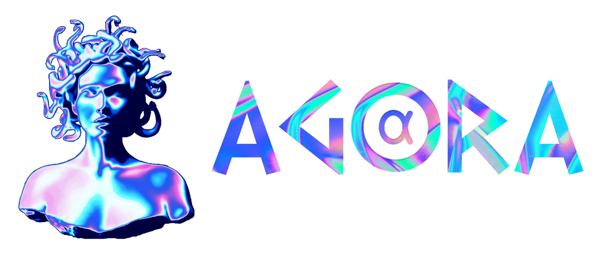

<h1 align="center">Agora</h1>

	

## About Agora

Agora provides the background logic, management, and security for your tokenized
communities.

It consists of a web user interface that allows users to connect to one of the
many communities or create their own, and a chatbot, Medousa, that does all the
dirty work from removing intruders to providing extra privileges to premium
users.

* [Website](https://agora.space)
* [Changelog](./CHANGELOG.md)
* [License](./LICENSE)

___

## Documentation

Full, comprehensive documentation is available in the [docs folder](./docs).

___

## Getting started

### For users

* [Joining a community](./docs/howto.md#joining_a_community)
* [Interacting with the bot](./docs/howto.md#interacting_with_the_bot)
* [Setting up a new community](./docs/howto.md#setting_up_a_new_community)

### For developers

* [Webserver and website](./docs/web.md)
* [Telegram bot documentation](./docs/telegram.md)

___

## Contributing

Thank you for your interest in contributing! Please refer to
[CONTRIBUTING.md](./docs/CONTRIBUTING.md) for guidance.
